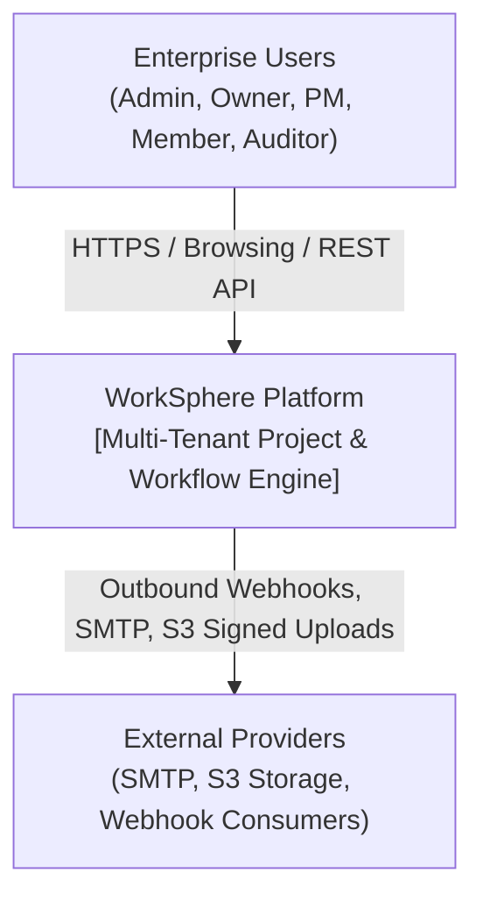
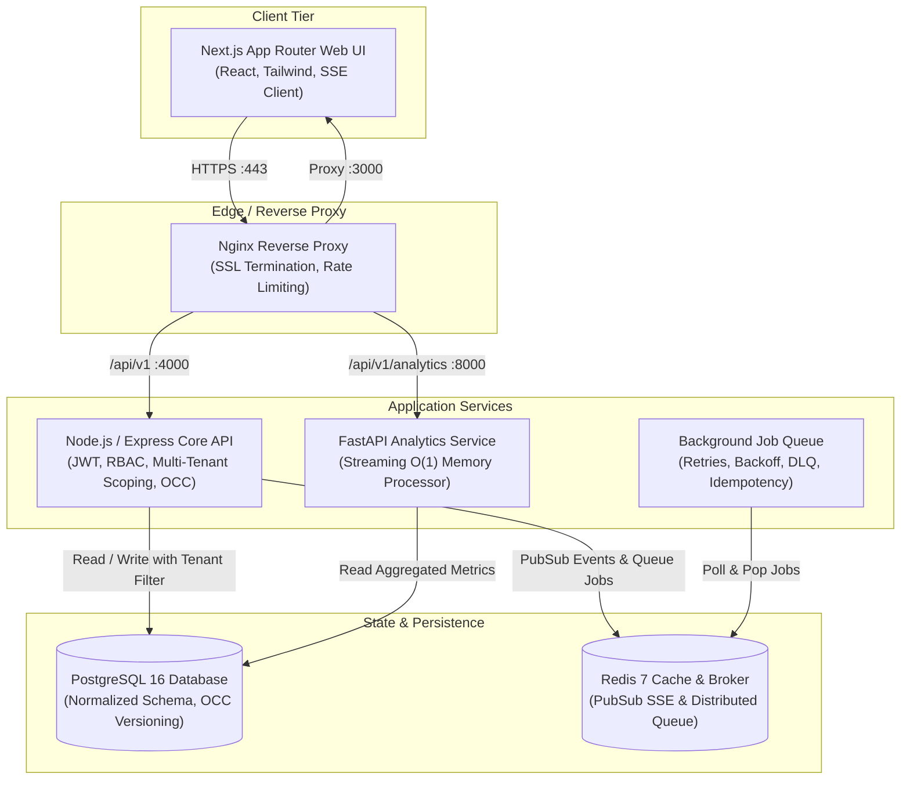
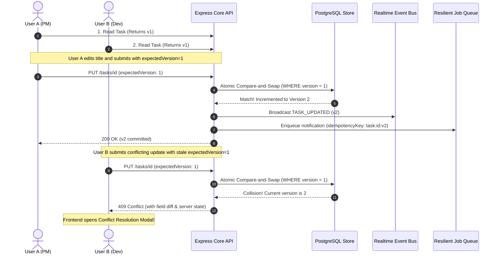

# WorkSphere C4 Architecture Specification

## 1. System Context Diagram (Level 1)

```mermaid
flowchart TD
    User["Enterprise Users<br/>(Admin, Owner, PM, Member, Auditor)"]
    ThirdParty["External Providers<br/>(SMTP, S3 Storage, Webhook Consumers)"]
    WorkSphere["WorkSphere Platform<br/>[Multi-Tenant Project & Workflow Engine]"]

    User -->|HTTPS / Browsing / REST API| WorkSphere
    WorkSphere -->|Outbound Webhooks, SMTP, S3 Signed Uploads| ThirdParty
```

## 2. Container Diagram (Level 2)

```mermaid
flowchart TD
    subgraph Client["Client Tier"]
        Browser["Next.js App Router Web UI<br/>(React, Tailwind, SSE Client)"]
    end

    subgraph Edge["Edge / Reverse Proxy"]
        Nginx["Nginx Reverse Proxy<br/>(SSL Termination, Rate Limiting)"]
    end

    subgraph AppTier["Application Services"]
        NodeAPI["Node.js / Express Core API<br/>(JWT, RBAC, Multi-Tenant Scoping, OCC)"]
        PythonAnalytics["FastAPI Analytics Service<br/>(Streaming O(1) Memory Processor)"]
        JobWorker["Background Job Queue<br/>(Retries, Backoff, DLQ, Idempotency)"]
    end

    subgraph DataTier["State & Persistence"]
        Postgres[("PostgreSQL 16 Database<br/>(Normalized Schema, OCC Versioning)")]
        Redis[("Redis 7 Cache & Broker<br/>(PubSub SSE & Distributed Queue)")]
    end

    Browser -->|HTTPS :443| Nginx
    Nginx -->|Proxy :3000| Browser
    Nginx -->|/api/v1 :4000| NodeAPI
    Nginx -->|/api/v1/analytics :8000| PythonAnalytics

    NodeAPI -->|Read / Write with Tenant Filter| Postgres
    NodeAPI -->|PubSub Events & Queue Jobs| Redis
    JobWorker -->|Poll & Pop Jobs| Redis
    PythonAnalytics -->|Read Aggregated Metrics| Postgres
```

## 3. Component Diagram: Task Management with OCC (Level 3)

```mermaid
sequenceDiagram
    autonumber
    actor UserA as User A (PM)
    actor UserB as User B (Dev)
    participant API as Express Core API
    participant DB as PostgreSQL Store
    participant Bus as Realtime Event Bus
    participant Queue as Resilient Job Queue

    UserA->>API: 1. Read Task (Returns v1)
    UserB->>API: 2. Read Task (Returns v1)

    Note over UserA,API: User A edits title and submits with expectedVersion=1
    UserA->>API: PUT /tasks/id (expectedVersion: 1)
    API->>DB: Atomic Compare-and-Swap (WHERE version = 1)
    DB-->>API: Match! Incremented to Version 2
    API->>Bus: Broadcast TASK_UPDATED (v2)
    API->>Queue: Enqueue notification (idempotencyKey: task:id:v2)
    API-->>UserA: 200 OK (v2 committed)

    Note over UserB,API: User B submits conflicting update with stale expectedVersion=1
    UserB->>API: PUT /tasks/id (expectedVersion: 1)
    API->>DB: Atomic Compare-and-Swap (WHERE version = 1)
    DB-->>API: Collision! Current version is 2
    API-->>UserB: 409 Conflict (with field diff & server state)
    Note over UserB: Frontend opens Conflict Resolution Modal!
```
