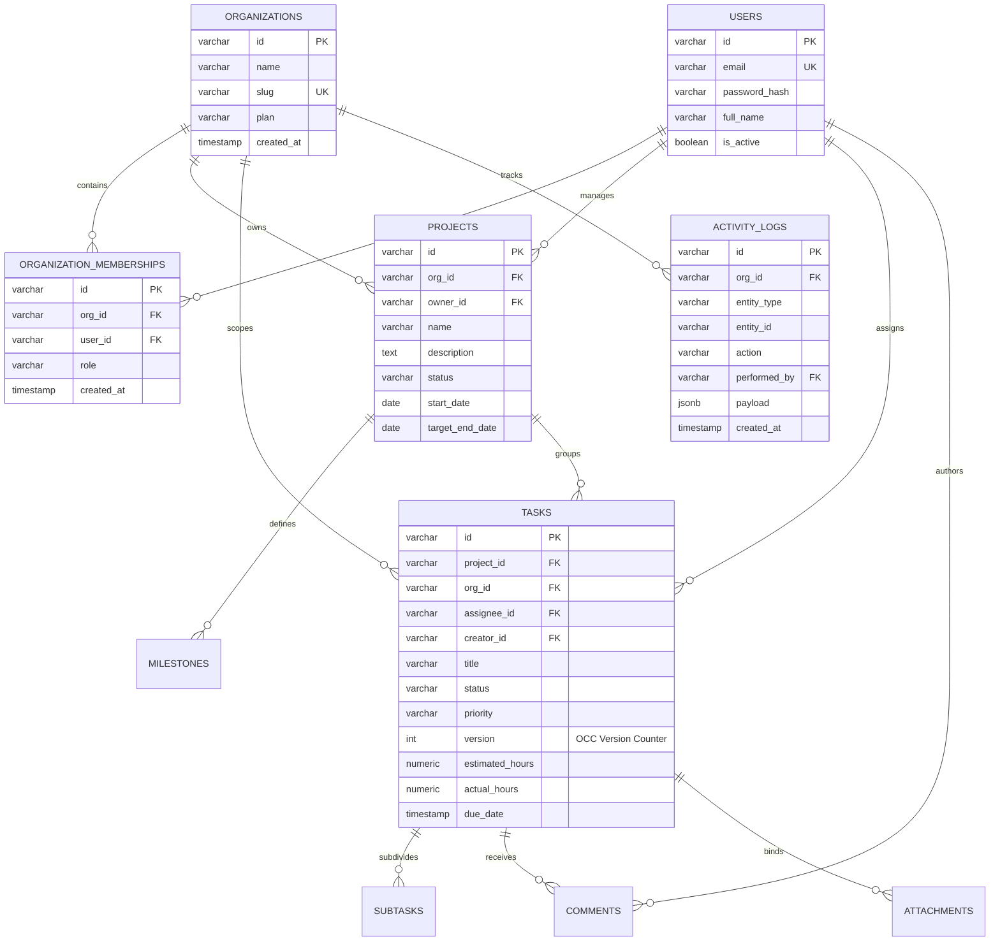

# WorkSphere Relational Entity-Relationship Diagram (ERD)

```mermaid
erDiagram
    ORGANIZATIONS ||--o{ ORGANIZATION_MEMBERSHIPS : contains
    ORGANIZATIONS ||--o{ PROJECTS : owns
    ORGANIZATIONS ||--o{ TASKS : scopes
    ORGANIZATIONS ||--o{ ACTIVITY_LOGS : tracks

    USERS ||--o{ ORGANIZATION_MEMBERSHIPS : holds
    USERS ||--o{ PROJECTS : manages
    USERS ||--o{ TASKS : assigns
    USERS ||--o{ COMMENTS : authors

    PROJECTS ||--o{ MILESTONES : defines
    PROJECTS ||--o{ TASKS : groups

    TASKS ||--o{ SUBTASKS : subdivides
    TASKS ||--o{ COMMENTS : receives
    TASKS ||--o{ ATTACHMENTS : binds

    ORGANIZATIONS {
        varchar id PK
        varchar name
        varchar slug UK
        varchar plan
        timestamp created_at
    }

    USERS {
        varchar id PK
        varchar email UK
        varchar password_hash
        varchar full_name
        boolean is_active
    }

    ORGANIZATION_MEMBERSHIPS {
        varchar id PK
        varchar org_id FK
        varchar user_id FK
        varchar role
        timestamp created_at
    }

    PROJECTS {
        varchar id PK
        varchar org_id FK
        varchar owner_id FK
        varchar name
        text description
        varchar status
        date start_date
        date target_end_date
    }

    TASKS {
        varchar id PK
        varchar project_id FK
        varchar org_id FK
        varchar assignee_id FK
        varchar creator_id FK
        varchar title
        varchar status
        varchar priority
        int version "OCC Version Counter"
        numeric estimated_hours
        numeric actual_hours
        timestamp due_date
    }

    ACTIVITY_LOGS {
        varchar id PK
        varchar org_id FK
        varchar entity_type
        varchar entity_id
        varchar action
        varchar performed_by FK
        jsonb payload
        timestamp created_at
    }
```
